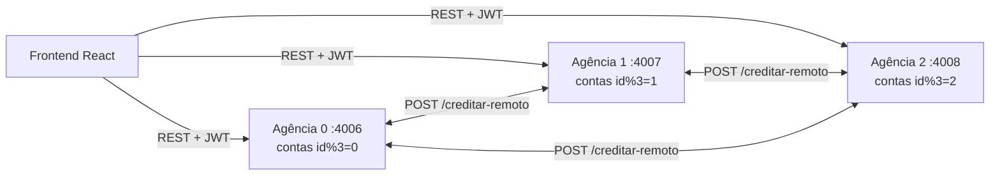
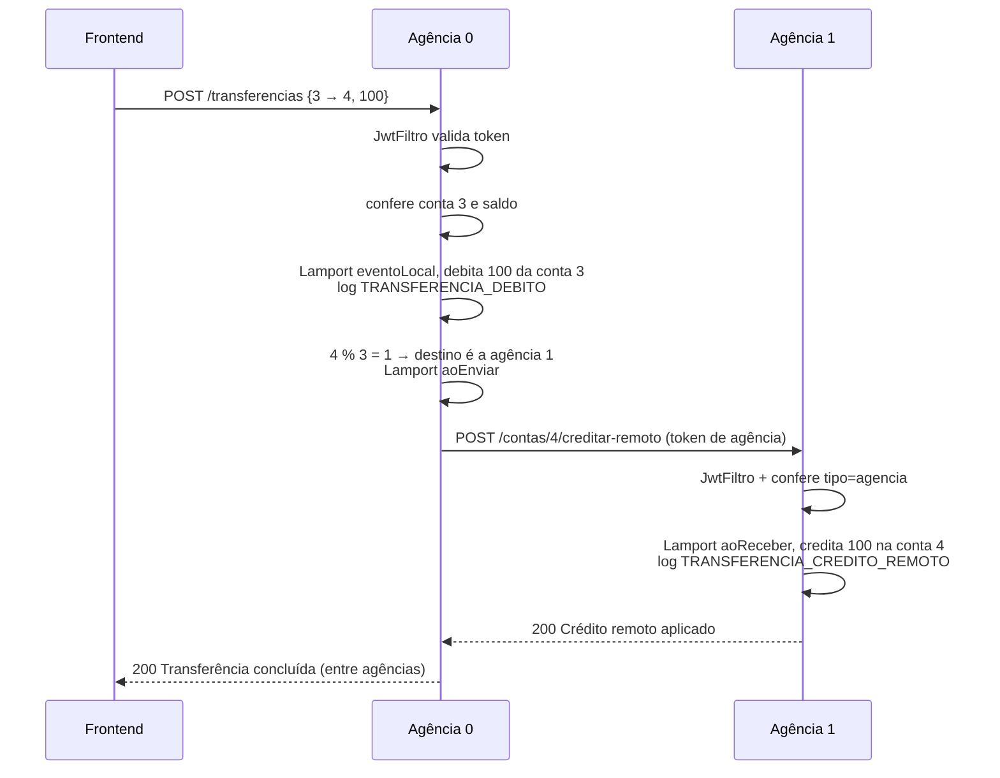
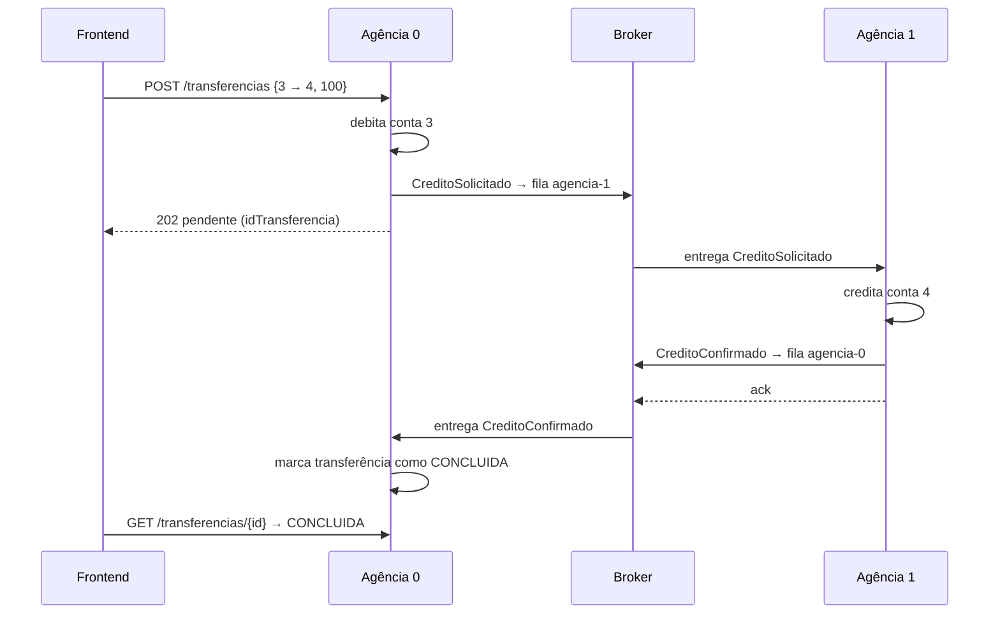

6. 4 Perguntas:

1- Porque adotando somente o time stamp recebido ele poderia "voltar no tempo" ou simplesmente perder a consistencia do seu atual.
2- Porque garante a ordem causal: se um evento causou outro, seu timestamp deve ser menor. Só copiar o timestamp recebido faria o relógio "andar para trás" quando o contador local já estivesse mais adiantado, quebrando a ordenação com os eventos locais anteriores. O max preserva o progresso local (ou adota o do remetente, se maior) e o +1 garante que o recebimento é sempre posterior ao envio.

8. 3
1- Porque aoEnviar()/aoReceber() servem para sincronizar relógios entre processos diferentes durante uma troca de mensagem. Na transferência local, débito e crédito ocorrem no mesmo processo, então basta eventoLocal() duas vezes. Já na transferência entre agências, o crédito é feito via chamada HTTP a outro processo — uma mensagem real —, então precisa de aoEnviar() na origem e aoReceber() no destino para preservar a causalidade entre os dois relógios.
2- não é revertido. Isso significa que o sistema fica inconsistente: o dinheiro "some" temporariamente, quebrando a atomicidade que uma transferência bancária deveria garantir.
3-2PC: só debitar de fato após o destino confirmar que pode receber.
Saga compensatória: se falhar o crédito remoto, credita de volta o valor na origem

10. 2
- São concorrentes, não tem relação causal. Se A influenciou B então l(A) < l(B), então eles nunca podem ter relação casual

10. 3
- A regra só vale em um sentido. Se A causou B, então L(A) < L(B). No outro sentido um relógio pode estar mais adiantado que o outro. Lamport mostra uma ordem possivel mas não mostra quem influenciou quem.

- Não. No passo 3 apareceram dois eventos de agências diferentes com o mesmo timestamp, e eles eram concorrentes. Só que se L(A) < L(B), isso pode significar tanto que A causou B quanto que os dois são independentes e um relógio só estava mais "adiantado", e o Lamport não consegue diferenciar esses casos porque ele é um único contador que mistura a história de todas as agências. Isso motiva o relógio vetorial.

11. 3
- Autenticação é verificar quem é o usuário. Autorização é verificar o que esse usuário pode fazer depois de identificado. Sim, um usuário autenticado consegue sacar de uma conta que não é dele. O sacar pega o id da URL e debita direto, sem comparar com o usuário do token.

-  Porque o JWT já carrega os dados dentro dele (usuário, tipo, expiração) e é assinado com a chave secreta. Para validar, o servidor só recalcula a assinatura com a chave que ele já tem e compara. Isso escala melhor do que sessão em memória: com sessão, cada servidor só conhece as sessões que ele criou, então com várias instâncias precisa de um lugar compartilhado (Redis, banco) ou de sticky session. Com JWT qualquer instância valida o token, tanto que um token gerado em uma agência funciona nas outras porque elas usam a mesma chave. A desvantagem é que não dá para invalidar um token antes de ele expirar.

-  Qualquer um com a chave consegue gerar tokens válidos, se passando por qualquer usuário ou até por uma agência (tipo "agencia"), e aí pode chamar o creditar-remoto e criar dinheiro em qualquer conta. O servidor não tem como diferenciar um token falso de um verdadeiro, e como a chave é a mesma nas 3 agências, todas ficam comprometidas. A única solução é trocar a chave, o que derruba todos os tokens. No caso da minha agencia elajá está exposta no application.properties.

12. 3
- Quando o login dá certo, o token que a API devolve é salvo no localStorage do navegador. Todas as chamadas à API passam por uma única função, a requisitar do api.js. Antes de cada requisição ela lê o token do localStorage e, se ele existir, coloca no cabeçalho Authorization: Bearer <token>. Então as telas não precisam se preocupar com o token, a função central faz isso sozinha. Como fica no localStorage, o token continua lá mesmo se a página for recarregada, e só é apagado quando a pessoa clica em Sair ou quando a API responde 401.

- O frontend não confere a expiração sozinho. Ele só descobre que o token expirou quando faz a próxima requisição e o backend responde 401 com "Token expirado.". Como o filtro JWT roda antes do controller, a operação nem chega a ser executada, então não tem risco de ficar pela metade. Quando chega o 401, o token é apagado e a tela volta para o login com a mensagem "Sessão encerrada: Token expirado. Faça login novamente.". Então não é um erro genérico, a pessoa sabe o motivo. O ponto ruim é que o que ela tinha digitado no formulário se perde e ela precisa refazer a operação depois de entrar de novo. Daria para melhorar avisando antes de expirar, usando o expiraEmSegundos que o login devolve, ou com refresh token.

- o modelo de verdade (a Conta, o saldo, as regras) está no backend. No frontend, o que mais se aproxima do Model é o api.js, que concentra o acesso aos dados, o token e a regra id % 3. Além dele, há os estados (useState) que guardam os dados que vieram da API.
- View: é o JSX dos componentes (Login, ConsultaSaldo, Transferencia etc.) e o App.css.
- Controller: são as funções que tratam os eventos dentro dos componentes (entrar, consultar, transferir, operar) e o hook useOperacao, que chama a API e transforma o resultado em mensagem de sucesso ou de erro, ou manda de volta para o login no 401. O App também tem um pouco de controller, porque controla a sessão e a agência selecionada.
A separação existe, mas está misturada: View e Controller ficam no mesmo arquivo e no mesmo componente. Para ficar mais perto do MVC, daria para tirar a lógica dos componentes para hooks próprios (ex.: useConta) e deixar os componentes só com o JSX.

2. 1 Funcionalidade adicional
1- Histórico por conta: GET /contas/{id}/historico (com ?limite=, padrão 20) lista os últimos eventos de uma conta, do mais recente para o mais antigo: abertura, depósito, saque, transferência enviada/recebida (local ou de outra agência) e rendimento do CDB, cada um com o timestamp de Lamport e o horário. Escolhi porque, como é um banco, ver o extrato da conta é uma funcionalidade útil, e o sistema já registrava tudo no log de eventos mas não tinha como consultar isso por conta. Também aparece no frontend, no cartão "Histórico da conta".

2- CDB: enquanto a agência está no ar, a cada 5 minutos cada conta com saldo recebe 0,1% do valor que tem na conta. Fiz porque achei que seria legal ter algo rodando em tempo real, uma regra que acontece sozinha com o sistema ativo, sem ninguém chamar um endpoint. Cada rendimento é um evento local no relógio de Lamport e aparece no histórico. A taxa e o intervalo ficam no application.properties (cdb.taxa e cdb.intervalo-ms). Precisei deixar os métodos da Conta synchronized, porque agora o agendador mexe nos saldos ao mesmo tempo que as requisições.


## Recapitulação: Mensageria, Pub/Sub e Relógio Vetorial (fechamento da Sprint 1)

### 1. Arquitetura atual e divisão em agências

O sistema tem 3 agências, que são o mesmo programa Spring Boot rodando 3 vezes. O que muda é a variável `AGENCIA_ID` (0, 1 ou 2), e a porta é `4006 + id` (4006, 4007, 4008). Cada processo tem:
- as contas dele em memória (`AgenciaState`, um `ConcurrentHashMap`), que somem quando ele reinicia;
- o próprio relógio de Lamport (`RelogioLamport`);
- um log de eventos em `data/eventos-agencia-N.jsonl` (`RegistroEventos`);
- o filtro JWT, com a mesma chave nas 3 agências, então um token emitido por uma vale nas outras;
- o agendador do CDB, que rende só as contas daquela agência.

Além delas tem o frontend React, que fala com qualquer agência pelo proxy do Vite (`/agencia0`, `/agencia1`, `/agencia2`), e o `MesclarLogs`, que junta os logs das 3 e ordena por Lamport.

A conta é associada à agência pela regra `id % 3` (`AgenciasConfig.agenciaResponsavel`). A conta 3 é da agência 0, a 4 da agência 1 e a 5 da agência 2. A agência recusa criar conta que não é dela, e as outras rotas devolvem 404 se a conta não estiver nela.

- **Operações locais:** criar conta, consultar saldo, depositar, sacar, histórico, rendimento do CDB e transferência quando origem e destino são da mesma agência.
- **Dependem de outra agência:** só a transferência em que o destino é de outra agência. A origem sempre tem que ser da agência que recebeu a requisição, que debita localmente e pede o crédito para a agência do destino.



### 2. Comunicação atual entre as agências

É comunicação **direta e síncrona por REST**. A agência de origem usa o `RestTemplate` para chamar `POST http://localhost:<porta>/contas/{id}/creditar-remoto` na agência do destino, com um token JWT de serviço (`tipo=agencia`, que vale 60s). O corpo é:

```json
{ "valor": 100.0, "timestampLamport": 7, "origemAgencia": 0 }
```

Respostas esperadas:
- **200** `{ "mensagem": "Crédito remoto aplicado.", "saldoAtual": 100.0 }`;
- **404**, se a conta não existe no destino;
- **403**, se o token não for de agência;
- **401**, se o token for inválido ou estiver expirado.

A origem fica parada esperando a resposta para só então responder ao cliente.

Problemas:
- **Destino fora do ar:** o `RestTemplate` lança `RestClientException`, a origem registra `TRANSFERENCIA_FALHOU` e responde 502, mas **o débito já foi feito e não é revertido**. O dinheiro some.
- **Destino responde erro (ex.: 404, conta não existe):** o `RestTemplate` também trata como exceção, então cai no mesmo caso e o dinheiro some do mesmo jeito.
- **Destino demora:** o `RestTemplate` foi criado sem timeout, então a thread da origem e o cliente ficam esperando indefinidamente.
- **A mensagem se perde na volta:** o destino creditou, mas a resposta não chegou (queda de rede ou timeout). A origem acha que falhou e responde 502, mas o dinheiro foi transferido. O cliente recebe a informação errada e, se tentar de novo, credita duas vezes.

Ou seja, as duas agências precisam estar no ar **ao mesmo tempo** (acoplamento temporal) e não existe nenhuma nova tentativa nem compensação.

### 3. Operações distribuídas e seus efeitos

Exemplo: transferir R$ 100 da conta 3 (agência 0) para a conta 4 (agência 1).



Dados alterados:
- saldo da conta 3 (agência 0) e saldo da conta 4 (agência 1);
- os dois logs `.jsonl`;
- os dois relógios de Lamport.

A agência 0 considera a operação concluída quando recebe o 200 da agência 1. Entre o débito e o crédito tem uma janela em que o dinheiro está "no ar": saiu de uma conta e ainda não chegou na outra. Se algo falhar nessa janela, fica inconsistente.

Os eventos distribuídos que aparecem aqui são: débito na origem, envio do pedido de crédito, crédito no destino e confirmação de volta. Um detalhe: hoje o envio (`aoEnviar`) **não é registrado no log**, só o débito e o crédito. Então nos logs não dá para ver o momento exato em que a mensagem saiu.

### 4. Eventos que precisam ser comunicados

| Evento | Dados | Produtor | Consumidores |
|---|---|---|---|
| `CreditoSolicitado` | idTransferencia, idOrigem, idDestino, valor, agenciaOrigem, relógio | agência de origem (após o débito) | agência do destino |
| `CreditoConfirmado` | idTransferencia, idDestino, valor, saldoAtual, relógio | agência do destino | agência de origem (marca como concluída), frontend/notificação, auditoria |
| `CreditoRecusado` | idTransferencia, motivo (ex.: conta não existe), relógio | agência do destino | agência de origem (faz o estorno do débito) |
| `RendimentoCdbAplicado` | idConta, valor, taxa, novoSaldo, relógio | cada agência | auditoria, histórico consolidado, notificação ao cliente |

Os dois primeiros substituem a chamada direta. O último é um evento puramente informativo: ninguém precisa responder, só quem tiver interesse escuta, e é aí que o Pub/Sub faz mais sentido.

### 5. Mensageria e comunicação indireta

Usando um broker (ex.: RabbitMQ), a transferência entre agências ficaria assim:

- **Canal:** um exchange `iceibank.transferencias` com uma fila por agência (`agencia-0`, `agencia-1`, `agencia-2`), roteadas pela chave `agencia.N`. Cada agência consome só a sua fila.
- **Produtor:** a agência de origem. Ela debita, publica `CreditoSolicitado` na fila do destino e responde ao cliente **202 (pendente)** com o `idTransferencia`, em vez de ficar esperando.
- **Consumidor:** a agência do destino, que lê a mensagem, credita e publica `CreditoConfirmado`, ou `CreditoRecusado` se a conta não existir, na fila da origem.
- **A origem consome a resposta:** se for confirmado, marca a transferência como concluída; se for recusado, faz o **estorno** (credita de volta). Para auditoria, os eventos também podem ir para um tópico `iceibank.eventos` onde qualquer um assina.



Exemplo de mensagem:

```json
{
  "idMensagem": "9b1c6e2a-3f4d-4c11-9a1e-0f7b2d5c8e10",
  "tipo": "CreditoSolicitado",
  "idTransferencia": "t-5f2a",
  "agenciaOrigem": 0,
  "agenciaDestino": 1,
  "idOrigem": 3,
  "idDestino": 4,
  "valor": 100.0,
  "vetor": [3, 0, 0],
  "horaParede": "2026-10-05T22:00:17Z"
}
```

A vantagem é que, se a agência 1 estiver fora do ar, a mensagem fica esperando na fila e é processada quando ela voltar, sem perder dinheiro.

### 6. Entrega, duplicidade e processamento de mensagens

- **Cenário de duplicidade:** brokers normalmente garantem entrega "pelo menos uma vez". Se a agência 1 credita a conta 4 e cai antes de mandar o ack, o broker entrega a mesma mensagem de novo. Hoje o `creditar-remoto` não tem nenhum identificador, então creditaria **duas vezes**. O mesmo acontece no REST atual se o cliente reenviar uma transferência que deu timeout.
- **Cenário de falha e reprocessamento:** a agência 0 debita e cai antes de publicar a mensagem, e o débito fica sem crédito. Ou a publicação dá certo, mas a agência 1 recusa (conta não existe), e a agência 0 precisa processar o `CreditoRecusado` para estornar. Se essa mensagem de recusa for processada duas vezes, o estorno também duplica.
- **Fora de ordem:** se a origem manda um crédito e depois um estorno ou cancelamento da mesma transferência e eles chegam invertidos, o destino processaria o cancelamento de algo que ainda não aconteceu.

Para processar com segurança, cada mensagem precisa de:
- **`idMensagem` / `idTransferencia` únicos (UUID):** o consumidor guarda os ids já processados e ignora repetidos, ou seja, idempotência;
- **ack só depois de processar e registrar**, para não perder mensagem;
- **relógio vetorial**, para saber a ordem causal e detectar quando algo chegou antes da causa;
- **estado da transferência** (PENDENTE, CONCLUIDA, ESTORNADA), para saber se uma resposta ainda faz sentido;
- **número de tentativas**, para mandar para uma fila de erro (DLQ) depois de N falhas.

### 7. Eventos concorrentes e ordenação causal

Cenário:
1. A agência 0 transfere R$ 100 da conta 3 para a conta 4 (agência 1). Chamamos de **evento A**.
2. A agência 1 recebe, credita, e logo depois a conta 4 transfere esses R$ 100 para a conta 5 (agência 2). Esse é o **evento B**, que é causado por A, porque só existe porque o dinheiro chegou.
3. Ao mesmo tempo, a agência 2 faz um depósito na conta 5. Esse é o **evento C**, que é concorrente com A e com B.

Um serviço de auditoria assina o tópico de eventos. Se a mensagem de B chegar antes da de A (filas diferentes, uma mais lenta), a auditoria vê a conta 4 gastando R$ 100 que ela ainda não tinha recebido. Ela poderia achar que a conta ficou negativa, ou que foi uma fraude. O mesmo vale para C: pela ordem de chegada não dá para saber se o depósito aconteceu "antes" ou "depois" da transferência, e na verdade não tem antes nem depois, porque eles são independentes.

Ou seja, existem três ordens diferentes: a **ordem local** (dentro de cada agência), a **ordem de recebimento** (como as mensagens chegaram) e a **ordem causal** (o que causou o quê). Com Lamport dá para garantir que, se A causou B, então L(A) < L(B). Mas, olhando L(B) < L(C), não dá para saber se é causal ou só um relógio mais adiantado. Por isso precisa do vetorial.

### 8. Relógio vetorial na aplicação

As 3 agências participam do vetor, então ele é `V = [ag0, ag1, ag2]`. Cada agência guarda o seu, no lugar do (ou junto com o) `RelogioLamport`. Ele é atualizado nos mesmos três momentos de hoje:
- **evento local** (depósito, saque, débito, CDB): `V[eu] += 1`;
- **envio de mensagem:** `V[eu] += 1`, e o vetor vai junto no campo `vetor` da mensagem;
- **recebimento:** `V[k] = max(V[k], Vmsg[k])` para cada k, depois `V[eu] += 1`.

Todo evento do log passa a ter o campo `vetor`.

Para comparar dois eventos X e Y:
- **X → Y (X causou Y):** todo `X[k] <= Y[k]` e pelo menos um é menor;
- **concorrentes:** nem X → Y nem Y → X.

Exemplo, partindo de tudo zerado:

| Evento | Agência | Vetor |
|---|---|---|
| D1: depósito na conta 3 | ag0 | [1,0,0] |
| D2: depósito na conta 5 | ag2 | [0,0,1] |
| T1: débito 3 → 4 e envio | ag0 | [2,0,0] → envia [3,0,0] |
| T2: crédito na conta 4 | ag1 | max([0,0,0],[3,0,0]) + 1 → [3,1,0] |

- **D1 e D2 são concorrentes:** [1,0,0] tem ag0 maior e [0,0,1] tem ag2 maior, então nenhum é ≤ ao outro.
- **T1 → T2 é causal:** [3,0,0] ≤ [3,1,0] em todas as posições, com ag1 menor. O crédito foi causado pelo envio.

Com Lamport puro, D2 teria L=1 e T2 teria L=4, e daria para achar que D2 veio "antes" de T2. O vetor mostra que eles não têm relação.

### 9. Consistência e observabilidade dos eventos

Cada evento do log precisaria ter:
- **`vetor`**: para comparar quaisquer dois eventos (antes, depois ou concorrente);
- **`idEvento`**: único, para referenciar;
- **`idMensagem` e `idTransferencia`**: para ligar o envio na origem ao recebimento no destino e à confirmação (correlação);
- **eventos de `ENVIO` e `RECEBIMENTO` explícitos**, que hoje não existem para o envio;
- `agencia`, `tipo`, `horaParede` e o Lamport, que já existem.

Com isso dá para verificar:
- **Uma mensagem foi produzida antes de outra?** Compara os vetores dos eventos de envio.
- **Dois eventos são concorrentes?** Nenhum vetor é ≤ ao outro.
- **Uma agência recebeu algo causado por outra?** Se a agência 1 tem um evento com `V[0] >= k`, então ela já "viu" o k-ésimo evento da agência 0, direta ou indiretamente.

O `MesclarLogs` evoluiria para ler os vetores e, além de ordenar, imprimir para cada par de eventos de agências diferentes se é `→` ou `||` (concorrente). Também apontaria mensagens que chegaram antes da sua causa.

### 10. Proposta de evolução para a próxima implementação

**Operação modificada:** a transferência entre agências deixa de ser uma chamada REST direta e passa a ser feita por mensagens.

**Componentes:**
- RabbitMQ, subindo com `docker compose`;
- as 3 agências, cada uma ao mesmo tempo produtora e consumidora da sua fila;
- o `RelogioVetorial`, novo, junto com o Lamport;
- o `MesclarLogs` atualizado;
- o frontend mostrando a transferência como "pendente" até a confirmação.

**Mensagens trocadas:** `CreditoSolicitado` (origem → destino), `CreditoConfirmado` e `CreditoRecusado` (destino → origem), e os eventos informativos no tópico `iceibank.eventos`.

**Metadados adicionados:** `idMensagem`, `idTransferencia`, `vetor`, `agenciaOrigem`/`agenciaDestino` e `tentativa`. O log ganha os eventos de envio e recebimento e o campo `vetor`.

**Mudanças no código:**
- `TransferenciasController` publica a mensagem e responde 202, em vez de usar o `RestTemplate`;
- um listener consome a fila da agência;
- um registro de transferências (PENDENTE, CONCLUIDA, ESTORNADA) com `GET /transferencias/{id}`;
- um conjunto de `idMensagem` já processados, para a idempotência.

**Como demonstrar que funciona:**
1. **Destino fora do ar:** desligar a agência 1, transferir de 3 para 4 e ver a transferência "pendente". Ligar a agência 1 e ver o crédito sair e a transferência virar "concluída", sem perder dinheiro, que hoje se perde.
2. **Duplicidade:** publicar a mesma mensagem duas vezes e ver que a conta 4 é creditada uma vez só e que o log mostra a duplicata ignorada.
3. **Recusa:** transferir para uma conta que não existe e ver o estorno na conta de origem e no histórico.
4. **Ordem causal:** fazer o cenário da pergunta 7 (A → B, com C concorrente) e mostrar no `MesclarLogs` que A → B e que C é concorrente com os dois, mesmo com as mensagens chegando fora de ordem.
